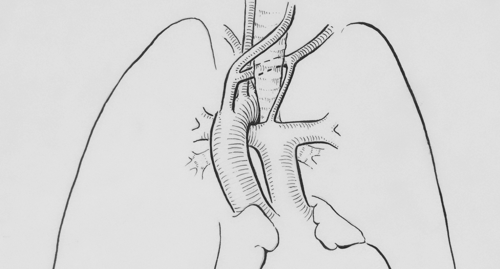
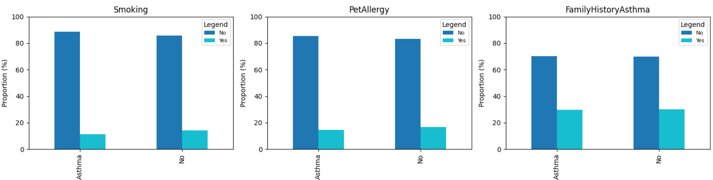
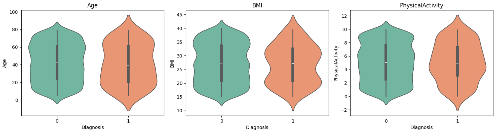

# Asthma Burden

## Project Overview

This project analyses the Asthma Disease Dataset from Kaggle to explore patterns in patient health data and develop machine learning models for asthma classification. Using data analytics and predictive modelling techniques, the project aims to identify key risk factors associated with asthma diagnoses and present insights through reproducible analysis and visualisations. The project was originally intended to investigate factors associated with clinical measures of disease severity and prognosis, particularly lung function. However, due to the dataset containing 2,392 individuals, of which only 124 are diagnosed with asthma (small pool for analyses), the scope was revised to focus on binary asthma prediction. The aim of the resulting analysis was to support identification of asthma risk and contributes to preventative, evidence-based clinical decision-making. Success metrics were defined in the business care, and were not met meaning recall and precision of asthma classification was poor.

Live page on [Heroku](https://asthmaburden-8ddd98655007.herokuapp.com/).

### Types of Asthma

* Allergic Asthma: Triggered by allergens such as pollen, dust mites, mold, or pet dander. Often begins in childhood and is associated with other allergic conditions.
* Non-Allergic Asthma: Symptoms are commonly triggered by infections, cold air, stress, or air pollution and often develop in adulthood.
* Exercise-Induced Bronchoconstriction: Airway narrowing triggered by physical activity, especially in cold or dry environments.
* Severe Asthma: Remains poorly controlled despite treatment.
* Eosinophillic Asthma: Characterised by frequent exacerbations (worsening of asthma) and elevant eosinophils (type of biomarker).

## Dataset Content

Data from the publicly available [Asthma Disease Dataset]( https://www.kaggle.com/datasets/rabieelkharoua/asthma-disease-dataset/data) was used. This dataset contained anonymised individual-level records, with each row representing a patient.

The dataset included the following variables:

| Category | Feature | Description / Notes |
| ---------- | --------- | ------------------- |
| **Lifestyle Factors** | BMI | Body Mass Index |
| | Smoking Status | 0: No, 1: Yes |
| | Physical activity | Frequency or intensity of physical activity, ranging from 0 to 10 |
| | DietQuality | Score indicating diet quality, ranging from 0 to 10 |
| | SleepQuality | Score indicating sleep quality, ranging from 4 to 10 |
| **Environmental and Allergy Factors** | PollutionExposure | Level of exposure to air pollution, ranging from 0 to 10 |
| | PollenExposure | Level of exposure to pollen, ranging from 0 to 10 |
| | DustExposure | Level of exposure to dust, ranging from 0 to 10 |
| | PetAllergy | 0: No, 1: Yes |
| **Medical History** | FamilyHistoryAsthma | 0: No, 1: Yes |
| | HistoryOfAllergies | 0: No, 1: Yes |
| | Eczema | 0: No, 1: Yes |
| | HayFever | 0: No, 1: Yes |
| | GastroesophagealReflux | 0: No, 1: Yes |
| **Clinical Measurements** | LungFunctionFEV1 | Forced expiratory volume in 1 second, ranging from 1 to 4 litres |
| | LungFunctionFVC | Forced vital capacity, ranging from 1.5 to 6 litres |
| **Symptoms** | Wheezing | 0: No, 1: Yes |
| | ShortnessOfBreath | 0: No, 1: Yes |
| | ChestTightness | 0: No, 1: Yes |
| | Coughing | 0: No, 1: Yes |
| | NighttimeSymptoms | 0: No, 1: Yes |
| | ExerciseInduced | 0: No, 1: Yes |
| **Diagnosis Information** | Diagnosis | 0: No, 1: Yes |
| **Confidential Information** | DoctorInCharge | Name of the doctor in charge (confidential) |

## Business Requirements

The client seeks to improve early identification of patients with asthma within a large general patient population. Because asthma cases represent a small minority, the project focuses on understanding the factors associated with asthma presence. Early detection enables targeted assessment and preventative interventions for individuals who may be at risk but not yet recognised clinically.

The objective of this project is to develop a machine learning model that predicts asthma status, using demographic, lifestyle, environmental, allergy‑related, medical history, and symptom‑based factors, alongside lung‑function indicators such as FEV1 and FVC. To achieve these objectives, the project will focus on the following key requirements:

### Business requirement one: Data visualisation and correlation study (Conventional Analysis)

Identify the key demographic, lifestyle, environmental, allergy-related, medical history, symptom-based, and clinical factors most strongly associated with asthma status. Provide visual and statistical insights to support clinical understanding of the primary drivers of asthma prior to model development.

Business Value: This analysis enables physicians and stakeholders to understand the primary drivers of asthma status, supporting clinical insight and hypothesis generation prior to model deployment.

### Business requirement two: Asthma Prediction via Supervised Learning (Machine Learning)

Develop a machine learning model capable of predicting whether an individual has asthma using an array of features. The model should account for class imbalance and prioritise sensitivity to asthma cases to support early identification and preventative clinical decision-making.

Business Value: This capability supports early detection of individuals who may have undiagnosed or under‑recognised asthma, enabling timely clinical follow‑up and preventative interventions.

## Hypothesis and Validation

To better understand the factors influencing asthma risk, four key hypotheses were formulated based on domain knowledge and the available data. Each hypothesis focuses on a variable expected to impact asthma status.

| Hypothesis | Rationale | Validation |
| ------------ | ----------- | ------------ |
| H1: Poorer clinical factors (lower LungFunctionFEV1 or LungFunctionFVX) is associated with asthma | Reduced airflow and obstruction are classic features of asthma | Compare distributions of lung function metrics by Diagnosis; use of t-tests or Mann-Whitney to confirm differences |
| H2: Presence of symptoms (Wheezing, ShortnessOfBreath, ChestTightness, Coughing, NighttimeSymptoms) is associated with asthma | Symptoms like wheeze are clinical hallmarks of asthma and likely predictive of diagnosis | Compare symptom prevalence by Diagnosis; assess association with Chi‑square tests |
| H3: Smoking exposure is associated with asthma | Smoking and secondhand smoke irritate airways and can exacerbate or trigger asthma symptoms | Compare SmokingHistory by Diagnosis; statistical tests for association |
| H4: Higher exposure to dust or pollutants is associated with higher asthma risk | Environmental irritants can trigger asthma attacks or chronic inflammation | Compare PollutionExposure, PollenExposure and DustExposure by Diagnosis; statistical test for differences |

## Rationale to map the business requirements to the data visualisation and machine learning tasks

### Business Requirement One

To identify and visualize the key demographic, lifestyle, environmental, allergy-related, medical history, symptom-based and clinical factors associated with asthma status. Asthma is characterised by airflow obstruction, reduced lung capacity, demographic and lifestyle factors and symptoms such as wheezing.

* Perform exploratory data analysis to examine distributions and group differences between asthma and non-asthma patients.
* Visualise key relationships using interpretable plots such as boxplots, bar charts, and feature-target correlation plots.
* Confirm findings by reviewing feature importance and model coefficients from trained machine learning models.

### Business Requirement Two

To develop a predictive model that identifies patients with asthma within a highly imbalanced dataset. This is important, as the dataset reflects a real-world population of patients, with patients with asthma reflecting a small sample. Demonstrating the detection of asthma cases within an imbalanced dataset is critical for real-world screening and early identification.

* Build and evaluate classification models to predict asthma status using all features in the dataset.
* Apply imbalance‑handling techniques (e.g., class weighting, oversampling, SMOTE, anomaly‑style detection) to improve sensitivity to asthma cases.
* Assess model performance using recall and precision.

## Business Case

The overall aim of this project to develop a supervised machine learning model that predicts whether a patient would have asthma or not. The model should provide a probability of asthma diagnoses for a given patient, to aid management and treatment.

### Business Requirement One (Conventional)

As mentioned previously, exploratory data analyses was performed to visualse the distrubution and group differences between asthma and non-asthma patients. Contingency tables were populated for each binary feature against asthma diagnoses. Additionally, chi-square/Fisher were performed to assess the associations between binary features and asthma_status. For continuous features, associations were tested using bivariate analyses, t-test or Mann-Whitney, based on normality. A p-value of <0.05 was deemed significant.

### Buiness Requirement Two (Machine Learning)

* Goal: To predict if a patient will have asthma (asthma_status). Probability of asthma diagnoses to be reported.
* Model Type: Supervised - Binary Classification
* Inputs: Demographic, Lifestyle, Environmental and Allergy, Medical History, Clinical measurements, and Symptom features
* Model Choice: Logistic Regression
* Success Metrics (Training and Test):
  * Recall for asthma ≥ 0.80 – to minimize false negatives (undiagnosed asthma cases predicted as non-asthma), ensuring sensitive detection of patients who actually have asthma.
  * Precision for asthma ≥ 0.60 – to reduce false positives, avoiding over-identifying healthy patients as asthmatic.
* Failure Conditions:
  * Overfitting - Model performs well on training data but poorly on test data.
  * Imbalanced performance - Large differences between recall and precision.
  * Unstable predictions - Variable outputs.
* Output Definition:
  * Binary prediction (0 = no asthma, 1 = asthma).
  * Probability of asthma (e.g., 0.76 = 76% chance of having asthma) to assist clinicians in risk assessment and prioritization.

## Dashboard Design

The goal of the dashboard is to provide comprehensive insights and intelligency to support real-world prediction of asthma status. There are multiple target statekholders, with their goal/outcome outlined in User Stories.

### Page One: Project Summary

* Purpose: To provide a clear overview of the project in terms of:
  * Project Introduction
  * Project Terms and Jargon
  * Dataset Overview
  * Business Requirements

### Page Two: Asthma Status Study

* Purpose: To provide an overview of key features associated with asthma status (Business Requirement One). The aim of this page is to help stakeholders understand associations with asthma status with clear visual insights. Page to be broken down by:
  * Inspect patient data
  * Distribution of data (violin plots and boxplots)
  * Statistical analysis: Table of results for continuous features
  * Statistical analysis: Table of results for binary features
  * Feature-target correlation figure

### Page Three: Project Hypotheses and Validation

* Purpose: To describe the project hypotheses and validation process.

### Page Four: Asthma Status Prediction Tool

* Purpose: To show the classification output for deriving asthma status (Business Requirement Two), alongside predictive model performance and interpretation:
  * Overview of the model objective (Business Requirement Two)
  * Overview of ML pipelines used and insights into model performance
  * Note, the Widget input fields for relevant features for deriving asthma status was not included due to success metrics not being met

## User Stories

These user stories outline the needs of various stakeholders, ensuring that the project delivers actionable insights and supports both clinical and technical decision-making. User stories explored in more detail, particularly for the data analyst covered [within the projects tab](https://github.com/users/CodingLL25/projects/12).

| Stakeholder | User Story | Goal / Outcome |
| ------------- | ------------ | ---------------- |
| Non-technical stakeholder (e.g.) healthcare manager) | I want a clear summary of the project’s objectives, dataset, and key requirements | So that I can quickly understand the purpose of the project and the insights it provides without needing technical expertise. |
| Data analyst | I want to investigate the relationships between specific patient features and asthma diagnosis using visualizations and exploratory analyses | So that I can uncover patterns, identify important risk factors, and generate evidence-based insights for healthcare teams. |
| Clinical researcher / Healthcare Analyst | I want to examine the project hypotheses about asthma risk factors and validate them with charts, statistics, and correlation analyses | So that I can determine which features are genuinely associated with asthma and support data-driven clinical conclusions. |
| Healthcare provider | I want to input a patient’s information and receive a predicted probability of asthma along with risk indicators | So that I can prioritize patients for follow-up, screening, or preventative interventions. |
| Technical reviewer / data scientist | I want to inspect the machine learning model, including key features, structure, and performance metrics | So that I can evaluate the model’s reliability, interpretability, and suitability for clinical decision support. |

## Testing

### Manual testing

#### Navigation

| Feature | Action | Expected Result | Test Result |
| --- | --- | --- | --- |
| Project Summary Page | Landing page | Dashboard menu shows four pages | Pass |
| Project Summary Page | Click on Asthma Status Study | Navigate to asthma study page | Pass |
| Project Summary Page | Click on Project hypothesis and validation | Navigate to project hypothesis and validation page | Pass |
| Project Summary Page | Click on Machine learning: predict asthma status | Navigate to predict asthma statuspage | Pass |

#### Asthma Status Study

| Feature | Action | Expected Result | Test Result |
| --- | --- | --- | --- |
| Inspect patient data | Click on inspect patient data | Shows patient data | Pass |
| Distribution of continuous data | Click on "distribution of continuous data" | Show violin plots | Pass - slow to load |
| Distribution of categorical data | Click on "distribution of categorical data" | Show box plots plots | Pass - slow to load |
| Continuous data significance | Click on "Continuous data significance" | Show table | Pass |
| Binary data significance | Click on "Binary data significance" | Show table | Pass |
| Feature-Target correlation | Click on "Feature-target correlation" | Show figure | Pass |

### Validator testing

Code was passed through [CI Python Linter](https://pep8ci.herokuapp.com/) with no issues noted (excluding the one noted below).

## Unfixed Bugs

* Asthma Status Study: empty table showing at when "Feature-Target Correlation" selected.
* Project Hypotheses: markdown for hypotheses table exceeds 79 characters. Not a bug but a formatting issue.

### Deployment

### Heroku

* The App live link is: [https://asthmaburden-8ddd98655007.herokuapp.com/](https://asthmaburden-8ddd98655007.herokuapp.com/)

### Files within the working directory required for deployment

1. Include a "setup.sh" file with the following information:
      mkdir -p ~/.streamlit/
      echo "\
      [server]\n\
      headless = true\n\
      port = $PORT\n\
      enableCORS = false\n\
      \n\
      " > ~/.streamlit/config.toml
2. Include a ".python-version" file containing the supported version of python (v3.12)
3. Include a proc.file with: web: sh setup.sh && streamlit run app.py

### Going live with Heroku

1. Log in to Heroku and create an App
2. At the Deploy tab, select GitHub as the deployment method.
3. Select your repository name and click Search. Once it is found, click Connect.
4. Select the branch you want to deploy, then click Deploy Branch.
5. The deployment process should happen smoothly if all deployment files are fully functional.
6. Click now the button Open App on the top of the page to access your App.
7. If the slug size is too large then add large files not required for the app to the .slugignore file.

## Main Data Analysis and Machine Learning Libraries

### Data Handling

* [Pandas](https://pandas.pydata.org/docs/index.html) – Data manipulation and analysis  
* [NumPy](https://numpy.org/doc/stable/) – Multi-dimensional arrays and advanced mathematical functions
* [SciPy](https://scipy.org/) – Scientific computing library with statistical tests  

### Data Visualisation

* [Matplotlib](https://matplotlib.org/) – Static, animated, and interactive visualizations
* [Seaborn](https://seaborn.pydata.org/) – Statistical data visualization for attractive and informative graphics

### Machine Learning

* [scikit-learn](https://scikit-learn.org/stable/) – Machine learning library for classification, regression, and clustering
* [XGBoost](https://xgboost.readthedocs.io/en/stable/) – Gradient boosting library for high-performance ML models
* [Feature-engine](https://feature-engine.trainindata.com/en/latest/) – Transformers to engineer and select features for ML models
* [Joblib](https://joblib.readthedocs.io/en/stable/) – Pipelining, caching, and saving/loading models

### Handling Imbalanced Data

* [imbalanced-learn](https://imbalanced-learn.org/stable/) – Tools for handling imbalanced datasets in classification tasks (e.g., BorderlineSMOTE)

### Pipelines & Preprocessing

* [scikit-learn Pipeline](https://scikit-learn.org/stable/modules/compose.html#pipeline) – Build ML pipelines
* [ColumnTransformer](https://scikit-learn.org/stable/modules/compose.html#columntransformer) – Apply transformations to subsets of features
* [SklearnTransformerWrapper](https://feature-engine.trainindata.com/en/latest/wrappers.html) – Wrap custom transformers for pipelines

### Interactive & Development Environment

* [Jupyter Notebook](https://jupyter.org/) – Interactive computing environment for running and documenting code
* [VSCode](https://code.visualstudio.com/) – Integrated development environment (IDE)
* [Streamlit](https://docs.streamlit.io/) – Build interactive dashboards and web apps

### Version Control & Deployment

* [Git](https://git-scm.com/) – Version control system
* [GitHub](https://github.com/) – Code hosting and collaboration platform
* [Heroku](https://heroku.com/) – Cloud platform for deploying applications

### Validation

* [PEP8 validation](https://pep8ci.herokuapp.com/) - to validate the code
* [Python Formatter](https://formatter.org/python-formatter) - to ensure alignment with PEP8 validation

### Media

* [Unsplash](https://unsplash.com/) for free images to use
* [Europeana](https://www.europeana.eu/item/744/item_3461740) for the lungs image used in the README file

## Credits

Based on the methodologies used in [Churnonmeter](https://github.com/CodingLL25/churnometer/tree/main), the Code Institutes walkthrough project. Some functions were either used directly from the walkthrough or customised. Additionally, the [LoanGuard](https://github.com/kathrinmzl/LoanGuard/tree/main) project was referenced throughout the development of AsthmaBurden as a great example of meeting project expectations, with clear overviews of the steps taken and insight into decision making behind predictive analytics.

The following tools were referenced throughout as well for furthering knowledge and best practices:

* [towardsdatascience](https://towardsdatascience.com/hyperparameter-tuning-the-random-forest-in-python-using-scikit-learn-28d2aa77dd74/) - understanding hyperparameter optimisation
* [geeksforgeeks](https://www.geeksforgeeks.org/machine-learning/random-forest-hyperparameter-tuning-in-python/) - understanding hyperparameter optimisation

## Acknowledgements

One final thank you to [Iuliia Konovalova](https://github.com/IuliiaKonovalova) for her endless support and guidance.
git. Note, git control was not as frequent as needed. Often comitted large changes at once (improvement for the future).
